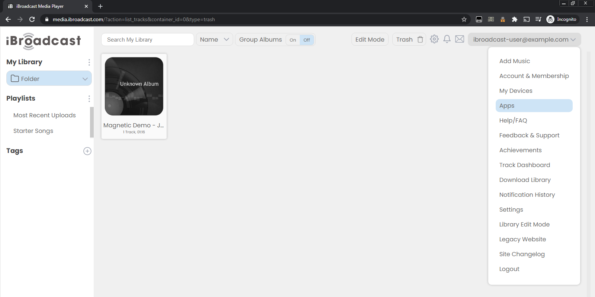
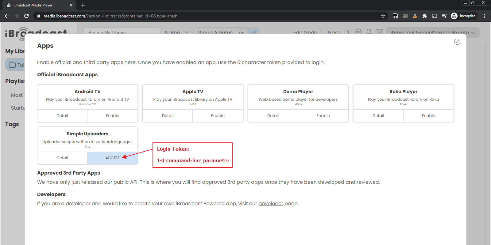
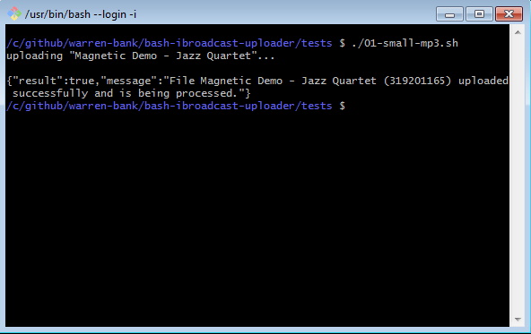

### [iBroadcast bash uploader script](https://github.com/warren-bank/bash-ibroadcast-uploader)

#### Description:

[iBroadcast](https://www.ibroadcast.com/) looks interesting:

* I just found out about this service, and plan to try it out on both Google and Amazon smart speakers
* I just uploaded 2GB of audiobooks to Dropbox and deleted the files from my computer
* I'd like to import my iBroadcast library from Dropbox, but don't see a way to upload files from remote URLs

The bash script in this repo:

* has the purpose to pipe a download stream (from the remote URL for an audio file) to an iBroadcast upload stream (to be added to the library for the account associated with a `login_token`)
  - even though my computer will need to redownload these files, it won't need to save them to the hard disk
* was written in about an hour
  - so go easy on me

#### Usage:

```bash
ibroadcast-uploader.sh <login_token> <filename> <URL>
```

where the `login_token` is obtained, as follows:<br>




and the output looks like:<br>



#### Requirements:

* bash
* curl
* node
  - used to parse the JSON API response

#### Notes:

```text
https://www.ibroadcast.com/
https://www.ibroadcast.com/faq/

https://www.ibroadcast.com/alexa/
https://www.amazon.com/iBroadcast/dp/B078WJQNLY

https://www.ibroadcast.com/googleassistant/
https://assistant.google.com/services/a/uid/00000062a9c339d2

https://www.ibroadcast.com/create
https://login.ibroadcast.com/?returnto=media.ibroadcast.com
https://media.ibroadcast.com/

===============
Alexa commands:
===============
  "Alexa, open iBroadcast"
  "Alexa, ask iBroadcast to play the playlist [name of playlist]"
  "Alexa, ask iBroadcast to play the album [name of album]"
  "Alexa, ask iBroadcast to play the artist [name of artist]"
  "Alexa, ask iBroadcast to play the song [name of song]"
  "Alexa, ask iBroadcast to turn off repeat mode"
  "Alexa, ask iBroadcast what song is playing"
  "Alexa, turn shuffle mode on"
  "Alexa, turn shuffle mode off"
  "Alexa, turn loop on" (loops the current playing song)
  "Alexa, turn loop off"

==========================
Google Assistant commands:
==========================
https://developers.google.com/assistant/ca-sunset
  deprecated, will stop working on June 13, 2023
==========================
  "Hey Google, talk to iBroadcast"
  "Hey Google, resume"
  "Hey Google, shuffle my library"
  "Hey Google, play playlist [name of playlist]"
  "Hey Google, play album [name of album]"
  "Hey Google, play artist [name of artist]"
  "Hey Google, play song [name of song]"
```

#### References:

```text
https://project.ibroadcast.com/

https://devguide.ibroadcast.com/
```

#### Legal:

* copyright: [Warren Bank](https://github.com/warren-bank)
* license: [GPL-2.0](https://www.gnu.org/licenses/old-licenses/gpl-2.0.txt)
